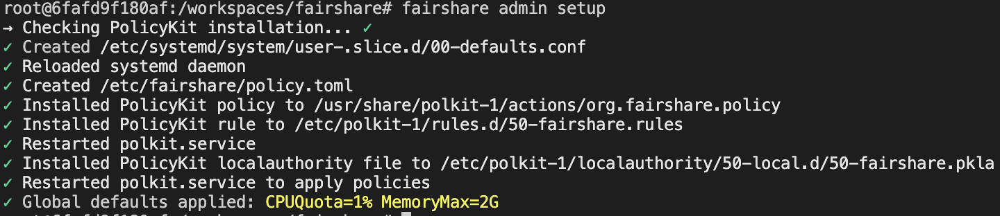
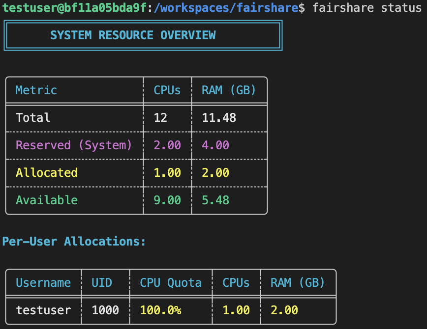
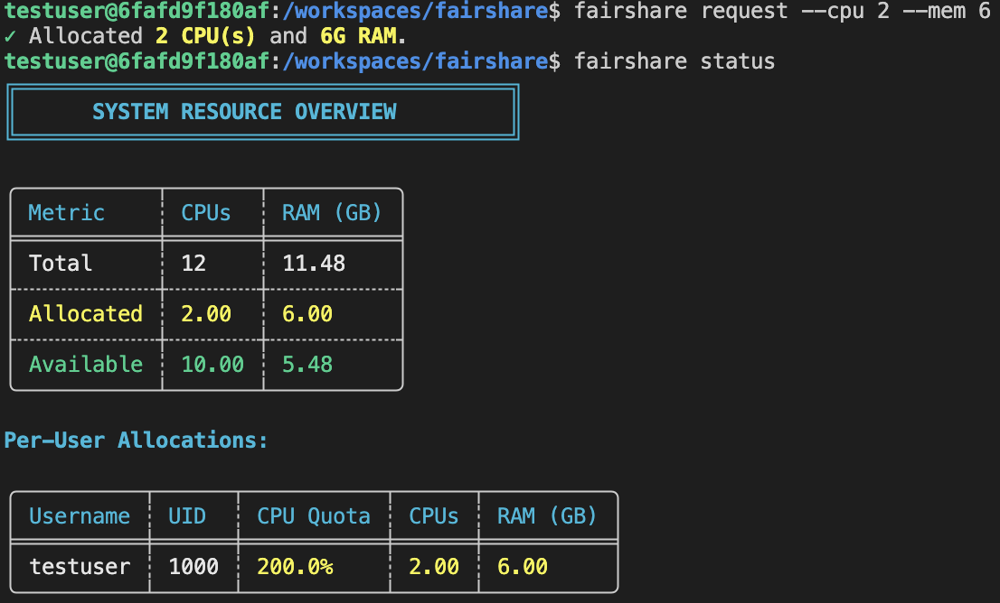
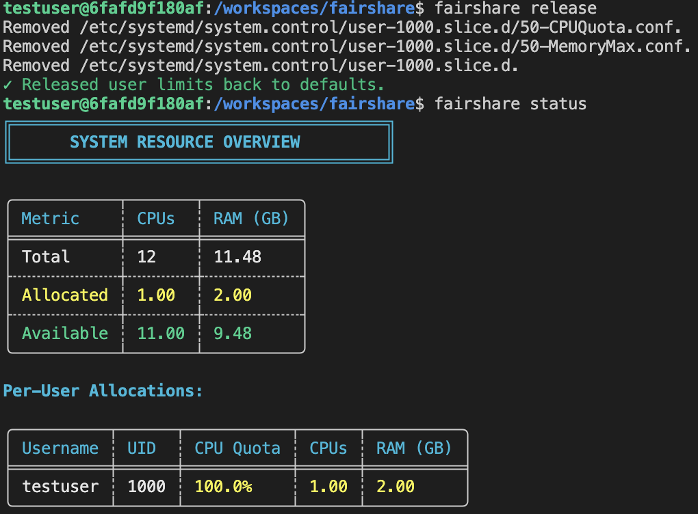

# fairshare

**Fair resource allocation for shared Linux systems**

A lightweight resource manager that prevents any single user from monopolizing CPU and memory on multi-user Linux servers. fairshare automatically enforces per-user limits while allowing users to request additional resources dynamically when they need them.

### The Problem fairshare Solves

On shared Linux systems, one user running a heavy workload can consume all available CPU and memory, leaving nothing for other users. This creates a terrible experience and reduces productivity.

### The Solution

fairshare allocates resources fairly across all users:
- **Default**: Each user gets 1 CPU core and 2GB RAM by default
- **On-demand**: Users can request more resources when needed (up to 1000 CPU cores and 10000 GB RAM)
- **Automatic**: The system grants requests only if resources are truly available
- **Fair**: No user can monopolize the entire system

## Installation

### Quick Install (Recommended)

The easiest way to install fairshare is using the installation script:

```bash
# Download and run the installer
curl -sSL https://raw.github.com/WilliamJudge94/fairshare/main/install.sh | sudo bash
```

Or if you prefer to inspect the script first:

```bash
# Download the installer
wget https://raw.github.com/WilliamJudge94/fairshare/main/install.sh

# Review it
cat install.sh

# Run it
sudo bash install.sh
```

The installer will:
- Download the latest release binary for your architecture
- Install the binary and wrapper script
- Set up PolicyKit policies
- Configure default resource limits (1 CPU core, 2GB RAM per user)



### Build from Source

If you prefer to build from source or are developing fairshare:

```bash
# 1. Build the release binary
cargo build --release

# 2. Run the installer (it will detect the local build)
sudo bash install.sh
```

Alternatively, use the Makefile for manual installation:

```bash
# Build and install binary and wrapper
cargo build --release
sudo make release

# Setup admin defaults and PolicyKit policies (REQUIRED)
sudo fairshare admin setup --cpu 1 --mem 2
```

### What Gets Installed

- **`/usr/local/bin/fairshare`** - Wrapper script (user-facing command)
- **`/usr/local/libexec/fairshare-bin`** - Real binary (internal use only)
- **PolicyKit policies** - Allow passwordless execution for active users
- **Systemd configuration** - Default resource limits for all user slices

The wrapper script automatically detects whether you're running an admin command (requires `sudo`) or a regular user command (automatically uses `pkexec`).

### Requirements
- **Linux** with systemd (including user session support)
- **PolicyKit (polkit)** for privilege escalation
- **Rust 1.70+** (only needed for building from source)

### Uninstall

To remove fairshare from your system:

```bash
# Using the uninstall script
curl -sSL https://raw.github.com/WilliamJudge94/fairshare/main/uninstall.sh | sudo bash

# Or if you have the repository
sudo bash uninstall.sh

# Or manually
sudo fairshare admin uninstall --force
```

## Usage Guide

### User Commands (No sudo required)

Regular users can manage their own resource allocations. The wrapper script automatically handles privilege escalation via PolicyKit, so you don't need to type `pkexec` or `sudo`.

#### 1. Check System Status
See how much CPU and memory is available and what each user is currently using.
```bash
fairshare status
```



#### 2. Check Your Current Allocation
View how much CPU and memory your user session has access to.
```bash
fairshare info
```

#### 3. Request Resources
Ask for CPU and memory resources. The system uses **smart delta-based checking** - it only needs enough free resources to cover the increase from your current allocation.

```bash
fairshare request --cpu 4 --mem 8
```



**Smart Allocation Example:**
- You currently have: 9GB RAM allocated
- System has: 2GB free
- You request: 10GB RAM
- Result: **SUCCESS** (net increase is only 1GB, which fits in the 2GB available)

**Constraints:**
- CPU: 1–1000 cores
- Memory: 1–10000 GB

#### 4. Release Resources
Return your resources to the system and revert to the default allocation (1 CPU core, 2GB RAM).
```bash
fairshare release
```



### Administrator Commands (Requires sudo)

> **Note:** Admin commands must be run with `sudo`

#### Set Default Limits
Configure the default CPU and memory allocation for all users when they first log in. This also installs PolicyKit policies required for passwordless user operations.

```bash
sudo fairshare admin setup --cpu 1 --mem 2
```


#### Uninstall fairshare
Remove fairshare from your system and revert to standard Linux resource management.
```bash
sudo fairshare admin uninstall --force
```

## How It Works

### Architecture

fairshare uses a wrapper script pattern to provide a seamless user experience:

1. **User types:** `fairshare status`
2. **Wrapper detects:** Not an admin command
3. **Wrapper calls:** `pkexec /usr/local/libexec/fairshare-bin status`
4. **PolicyKit checks:** User is active → allow without password
5. **Binary executes:** Reads `PKEXEC_UID` to identify calling user
6. **systemd query:** Only queries/modifies the calling user's slice

This architecture ensures:
- **Simple UX** - No `pkexec` in commands
- **Security** - Users can only manage their own resources
- **Proper privilege separation** - Wrapper handles escalation transparently

### Resource Management

fairshare uses systemd as the authoritative source of truth for all resource allocations:

1. **Resource Tracking**: All allocations are stored directly in systemd user slices (`user-{UID}.slice`)
2. **Dynamic Querying**: The system queries systemd in real-time to get current allocations (no persistent state file)
3. **Delta-Based Checking**: When you request resources, fairshare calculates the net change from your current allocation
4. **Privilege Escalation**: Uses pkexec (PolicyKit) to allow users to modify their own slices without full root access

## Troubleshooting

### Commands fail with "authentication required" or "permission denied"
If PolicyKit authentication keeps prompting for password, verify that admin setup completed successfully:
```bash
sudo fairshare admin setup --cpu 1 --mem 2
```

This installs the PolicyKit policies that allow active users to run fairshare commands without entering a password.

### Wrapper not found or binary not found
If you get "command not found" errors, ensure the installation completed:
```bash
# Reinstall using the install script
sudo bash install.sh

# Or if building from source
sudo make release

# Verify installation
which fairshare              # Should show /usr/local/bin/fairshare
ls -l /usr/local/libexec/fairshare-bin  # Should exist
```

### Resource request fails even though resources seem available
Remember that fairshare uses delta-based checking. Check your current allocation:
```bash
fairshare info
```

Then check system-wide availability:
```bash
fairshare status
```

Your request fails only if the **net increase** exceeds available resources.

### Changes don't take effect
After running `sudo fairshare admin setup`, systemd needs to reload:
```bash
sudo systemctl daemon-reload
```

## License

This project is open source.
